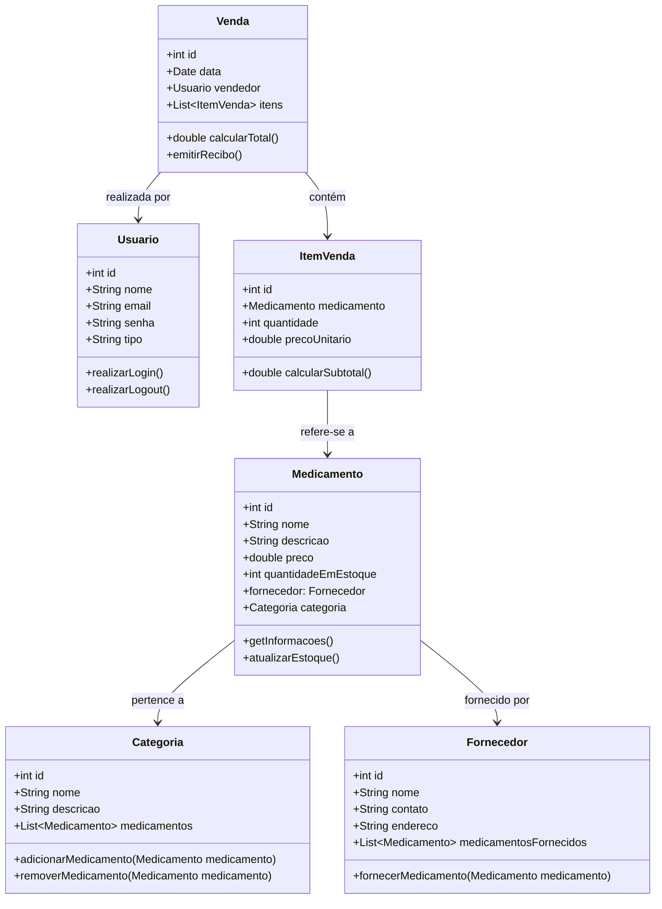

# **Projeto de Farmácia - Sistema de Gerenciamento de Medicamentos**

Este repositório contém um sistema para gerenciamento de medicamentos, desenvolvido com o objetivo de organizar o controle de estoque e automatizar processos comuns de uma farmácia. O projeto foi criado como parte de uma iniciativa de aprendizado em desenvolvimento de software.

---

## **Funcionalidades**
- 📋 **Cadastro de Medicamentos**: Registre medicamentos no sistema com detalhes como nome, descrição e quantidade.
- 📦 **Controle de Estoque**: Acompanhe e atualize o estoque de medicamentos com facilidade.
- 🔍 **Busca de Medicamentos**: Pesquise medicamentos cadastrados por meio de filtros ou palavras-chave.
- 📝 **Histórico de Movimentações**: Monitore alterações no estoque, incluindo entradas e saídas de produtos.
- 🔒 **Autenticação de Usuários**: Controle o acesso ao sistema com um mecanismo de autenticação.

---

---
## Tecnologias utilizadas

| Item                          | Descrição         |
| ----------------------------- | ----------------- |
| **Servidor**                  | Node JS           |
| **Linguagem de programação**  | TypeScript        |
| **Framework**                 | Nest JS           |
| **ORM**                       | TypeORM           |
| **Banco de dados Relacional** | MySQL(local       |
| **Banco de dados Relacional** | Postgres(deploy)  |

---

## Diagrama de Classes 📊

## Configuração e Execução

1. Clone o repositório
2. Instale as dependências: `npm install`
3. Configure o banco de dados no arquivo `app.module.ts`
4. Execute a aplicação: `npm run start:dev`
